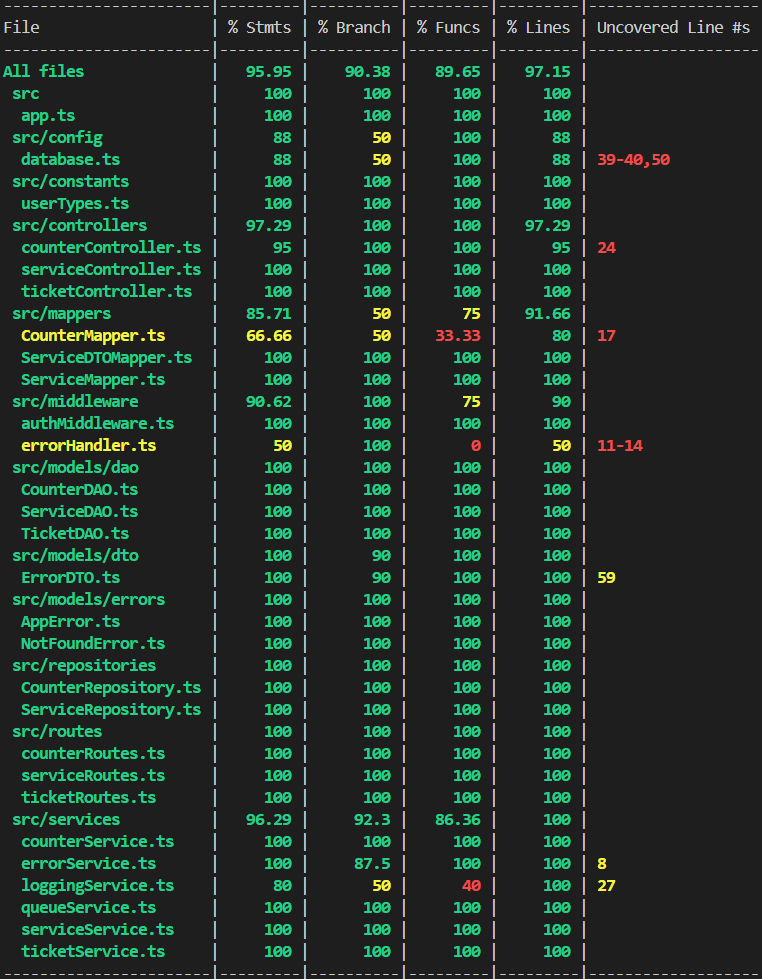

# RETROSPECTIVE (Team 18)

=====================================

Index:

- [process measures](#process-measures)
- [quality measures](#quality-measures)
- [general assessment](#assessment)

## PROCESS MEASURES

### Macro statistics

#### Number of stories committed vs. done

- Committed Stories: 2
- Stories Done: 2

#### Total points committed vs. done

- Committed Points: 10
- Points Done: 10

#### Nr of hours planned vs. spent (as a team)

- Planned Hours: 65h 10m
- Spent Hours: 63h 55m

##### Our definition of DONE

- Unit Tests passing
- Code review completed, aprroval from at least one other team member
- Code present on GitHub
- End-to-End tests performed (or at least Integration)
- Manual testing for frontend

#### Detailed statistics

| Story             | # Tasks | Points | Hours est. | Hours actual |
| ----------------- | ------- | ------ | ---------- | ------------ |
| _Uncategorized_   | 11      | 0      | 3d 3h 40m  | 3d 3h 35m    |
| 1 - Get Ticket    | 12      | 2      | 2d 5h      | 2d 5h 25m    |
| 2 - Next Customer | 9       | 8      | 2d 30m     | 1d 6h 55m    |

- Hours per task average, standard deviation

|            | Mean   | StDev  |
| ---------- | ------ | ------ |
| Estimation | 2h 02m | 2h 13m |
| Actual     | 1h 59m | 2h 15m |

##### Total estimation error ratio = 0.192

##### Absolute relative task estimation = 0.089

## QUALITY MEASURES

### Unit Testing

- Total hours estimated = 8h
- Total hours spent = 9h
- Nr of automated unit test cases = 35

### E2E testing

(we actually only did integration testing)

- Total hours estimated = 6h
- Total hours spent = 5h 30m
- Nr of test cases = 57

### Code review

- Total hours estimated = 6h
- Total hours spent = 5h 10m

#### Coverage

## ASSESSMENT

- What did go wrong in the sprint?
We completed the task division later than expected, which led us to start working on some uncategorized tasks just for managing to cover the user stories that we choosed.
Also we added unit and integration tests but didn’t include separate end-to-end tests, as we overlooked this detail.

- What caused your errors in estimation (if any)?
Some tasks turned out to be much easier than we initially expected.
Additionally, one team member joined later and needed extra time to understand the previous work and get fully involved in the development process, and as we delayed with task separetion the estimation was not so accurate.

- What lessons did you learn (both positive and negative) in this sprint?
During the first sprint, we learned how to plan and collaborate more effectively as a team.
Also that the accurate planning taking more time and effort that we expected.

- Which improvement goals set in the previous retrospective were you able to achieve?
- Which ones you were not able to achieve? Why?

- Improvement goals for the next sprint and how to achieve them (technical tasks, team coordination, etc.)
Create separate task for bug fixing.
Try to close tasks faster (move code from dev to main earlier) so the YouTrack burndown chart looks more accurate.

- One thing you are proud of as a Team!!
We are proud that we could easily rely on each other thanks to being well-organized as a team.
